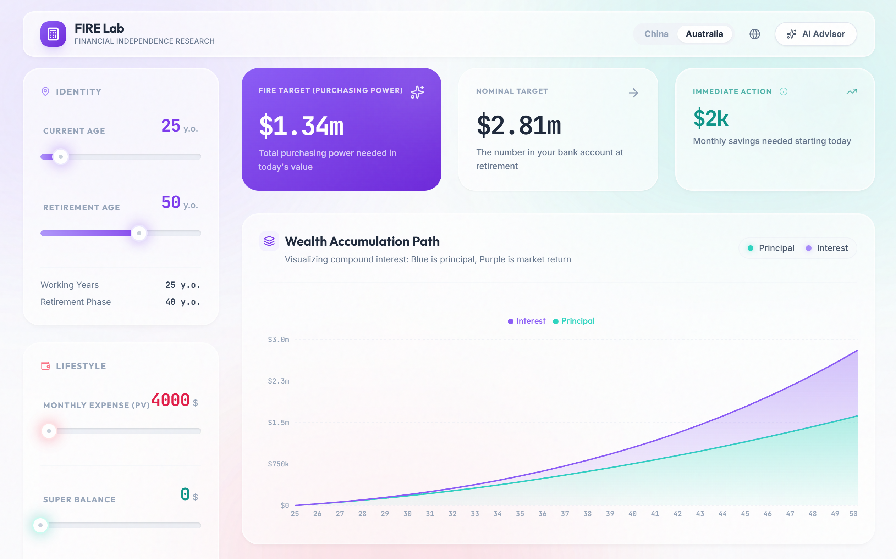

<div align="center">
  <h1>FIRE Lab</h1>
  <p>
    <strong>Financial Independence Research & Simulation Engine</strong>
  </p>
  <p>
    A high-fidelity financial simulation instrument designed to visualize the path to financial independence with optical precision and fluid interactivity.
  </p>
  <br />
  
  
  
  
  
  
  <br />
  <br />
  <a href="https://free-fire-calculator.vercel.app/" target="_blank"><strong>Live Demo → free-fire-calculator.vercel.app</strong></a>
</div>

<br />

<div align="center">
  
</div>

<br />

## Engineering & Design

This project combines a high-performance, region-aware financial simulation engine with a polished user interface. The design aims for clarity and precision, utilizing a "Luminous Clarity" aesthetic to present complex data intuitively while remaining mathematically rigorous.

## Mathematical Core

The engine is built on a two-phase deterministic simulation model with separate strategies for **China (CN)** and **Australia (AU)**.

### 1. Shared Retirement Need Solver (Decumulation)
Rather than using a fixed "4% rule", we solve for the exact required capital $K$ via **binary search** on top of a monthly cash-flow simulator.

Let:

- $I$ – annual inflation (decimal), $R$ – annual nominal return.
- $i_m = (1 + I)^{1/12} - 1$ – effective monthly inflation.
- $r_m = (1 + R)^{1/12} - 1$ – effective monthly return.
- $T_{now}$ – current age, $T_{ret}$ – retirement age, $T_{death}$ – life expectancy.
- $E_{now}$ – current monthly expense (in today's purchasing power).

We first roll expenses to retirement:

$$ E_0 = E_{now} \cdot (1 + i_m)^{12 (T_{ret} - T_{now})} $$

Then simulate $M = 12 (T_{death} - T_{ret})$ retirement months:

$$
\begin{aligned}
E_{m+1} &= E_m \cdot (1 + i_m) \\
W_{m+1} &= (W_m - E_m) \cdot (1 + r_m)
\end{aligned}
$$

We binary-search over $K = W_0$ until the simulated path never breaches a small negative tolerance. The same solver also produces:

- A **yearly simulation path** $(\text{portfolioStart},\ \text{portfolioEnd},\ \text{expenses})$ for charting.
- A **present value** discounting $K$ back to today:

$$ K_{PV} = \frac{K}{(1 + I)^{T_{ret} - T_{now}}} $$

This solver underlies both CN and AU strategies.

### 2. Career-Aware Accumulation Solver (Growth Phase)

To compute the monthly saving schedule that reaches a target at retirement, we assume **non-linear wage growth** instead of a flat saving rate.

- For each age, a **real wage growth** $g_{real}(age)$ (above inflation) is defined piecewise (fast in early career, plateau later).
- Nominal wage growth combines real and inflation:

$$ g_{nominal} = (1 + g_{real}) (1 + I) - 1 $$

- We simulate $N = 12 (T_{ret} - T_{now})$ months. At the beginning of each year, a **wage multiplier** $w_t$ is updated by $1 + g_{nominal}$.
- Monthly savings in month $t$ are:

$$ S_t = S_0 \cdot w_t $$

Each contribution grows to retirement at $r_m$; the capital at retirement is:

$$ \text{Target} = \sum_{t=0}^{N-1} S_t \cdot (1 + r_m)^{N - 1 - t} $$

We solve for the **first-year monthly saving** $S_0$:

$$ S_0 = \frac{\text{Target}}{\sum_{t=0}^{N-1} w_t \cdot (1 + r_m)^{N - 1 - t}} $$

The app displays this as the "Immediate Action" figure, explicitly labeled as the **first-year monthly saving** under the career-growth model.

### 3. Region-Specific Logic: CN vs AU (Superannuation)

For China (CN), the FIRE calculation is straightforward: all wealth is a single liquid pool.

For Australia (AU), we model two buckets:

- **Liquid assets** – freely accessible.
- **Superannuation** – locked until a preservation age (assumed 60).

Steps:

1. Use the shared solver to compute:
   - Required capital to fund **retirement → min(60, death)** (bridge period).
   - Required capital at access age (max(retirement, 60)) to fund **access age → death**, then discount this back to retirement.
2. Combine these to obtain the **minimum total capital** needed at retirement. This number is independent of the current Super balance: it is purely driven by the expense path.
3. Project today's Super balance forward to the access age using $r_m$, discount it back to retirement, and let Super cover part (or all) of the post‑60 requirement.
4. Solve the accumulation problem only for the **remaining liquid gap**. Super thus:
   - Reduces required liquid savings and initial monthly saving.
   - Does **not** artificially increase the FIRE Target when Super is already more than enough.

### 4. Trend Analysis & Sensitivity

To compute the "Retirement Age Sensitivity" chart, we sweep candidate retirement ages (30–65), and for each:

- Run the full CN/AU FIRE calculation with that retirement age.
- Collect:
  - Required nominal wealth.
  - Present-value wealth.
  - First-year monthly savings.

This produces a smooth curve of **required capital vs. retirement age** and **savings pressure vs. retirement age** for interactive exploration.

### 5. Performance Model

All heavy computations (FIRE solver, CN/AU trend sweep) are executed in **Web Workers**:

- `calc.worker.ts` – base FIRE calculation, driven by the latest committed parameters.
- `trend.worker.ts` – retirement age sensitivity sweep.

The main React tree uses `useDeferredValue` and job IDs to keep the UI responsive while background workers recompute results.

---

## Core Features

### 1. Liquid Interaction Engine
The core input mechanism is reimagined through the **"Liquid Slider"**. Unlike standard browser inputs, this component uses direct DOM manipulation and `requestAnimationFrame` to achieve 60fps sub-pixel precision. The interaction mimics the viscosity of liquid, offering a magnetic, tactile response that makes financial planning feel organic rather than administrative.

### 2. Optical Glass Interface
Every UI element is treated as a physical object within a light field.
-   **Shining Edges**: Borders are not solid lines but gradients that simulate light catching the edge of cut glass.
-   **Colored Glows**: Shadows are not black but colored diffusions derived from the content, creating a soft, ambient lighting effect.
-   **Atmospheric Depth**: A dynamic background mesh breathes slowly, providing a subconscious sense of life and movement.

### 3. Intelligent Financial Projection
Beyond aesthetics, the engine performs rigorous, deterministic financial modeling:
-   **Compound Growth Visualization**: Real-time rendering of accumulation vs. interest, split by principal and market returns.
-   **Sensitivity Analysis**: CN/AU-aware retirement age sweeps that show how "savings pressure" falls as you retire later.
-   **Depletion Simulation**: Month-by-month asset drawdown during retirement, testing portfolio longevity against inflation and lifespan.

### 4. AI-Assisted Advisory
Integrated with advanced large language models to provide personalized, context-aware financial analysis. The system evaluates the user's unique parameters (location, spending, goals) to generate bespoke advice on feasibility and risk management.

---

## Technical Architecture

The project is built on a modern, performance-first stack:

-   **Framework**: React 19 + Vite 6 (for instant HMR and optimized builds)
-   **Language**: TypeScript 5 with strict typing for all financial models.
-   **Styling**: Tailwind utility classes + custom design tokens (Wisdom/Growth/Life palettes).
-   **Locale & Region**: `LocaleProvider` context for language (zh/en) and region (CN/AU), including currency symbol overrides and fully localized UI copy.
-   **State Management**: React Hooks (`useDeferredValue`, memoization) to separate high-priority UI updates from heavy calculation threads.
-   **Performance**: Web Workers for off-main-thread FIRE calculations and trend analysis, ensuring zero UI blocking and fluid "Liquid Slider" interactions.
-   **AI Integration**: Optional Gemini API client (`@google/genai`) for generating personalized FIRE commentary based on the computed targets.

---

## Getting Started

### Prerequisites
-   Node.js 18+
-   npm or pnpm

### Installation

1.  **Clone the repository**
    ```bash
    git clone <your_repo_url> fire-lab
    cd fire-lab
    ```

2.  **Install dependencies**
    ```bash
    npm install
    ```

3.  **Configure Environment**
    Create a `.env` file in the root directory and add your API key for the advisory service (used by the in-app AI advisor; the core calculator works without it):
    ```env
    API_KEY=your_api_key_here
    ```

4.  **Run Development Server**
    ```bash
    npm run dev
    ```

5.  **Build for Production**
    ```bash
    npm run build
    ```

---

<div align="center">
  <p>Designed & Engineered with precision.</p>
</div>
